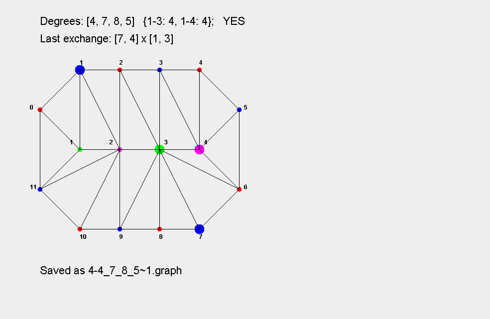

现代图论 —— 找寻基本模块
================

### 项目说明
此项目为北京大学研究生课程《现代图论》的任务：尽可能找寻外圈为12的半极大平面图的基本模块

 

基本模块是一个半极大平面图，要满足如下条件：

  * 可以从基础基本模块（内部只有两个点）通过变换生成
  * 里面是一棵树；且这棵树的内部节点的度数不小于5，叶子节点的度数不小于4
  * 如果将图边界1-2染色，内部节点3-4染色，则(1,3)子图的连通分支数应等于(1,4)子图的连通分支树

 

本项目主要有如下特性：

  * 使用Java Swing进行可视化绘图；外部使用红蓝染色，内部使用绿色和紫红色染色。
  * 只支持内部节点为一条链的情况
  * 支持两类操作：**添加**，**变换**。添加是向当前链的最右边增加一个节点；变换则是对当前的图，选两条边进行变换
  * 支持撤销操作，可以存档与读取；存档时会同时保存当前图的信息，和一张png图片
  * 支持同构判断，每次变换后都会判断变换后的图片是否与某一个已经保存的图同构
  * 支持快捷键操作（a: 添加；n: 变换；u: 撤销；s: 存档；l: 读档；c: 检查所有保存的图是否存在同构）

 

### 编译运行

请使用IntelliJ IDEA进行编译运行。请确保有Java 1.8的环境。

 

打开程序后，将加载原始的基本模块。  

每次可以进行三类操作：添加，删除，撤销。  
按A键，或点击菜单栏上的Add a point选项可以向内部的链的最右端添加一个3度节点。  
按N键，或点击菜单栏上的Next generation选项，可以尝试进行一次变换。  
按U键，或点击菜单栏上的Undo选项，可以撤销当前操作，回退到上一张图。

可以使用S（菜单栏上的Save选项）和L（菜单栏上的Load选项）进行保存与读取。  
保存时，如果当前图不是一张有效的图，或者已经保存过与其同构的图，则会用对话框进行提示。  
一次会同时保存两个文件，\*.graph和\*.png，分别为当前图的信息，和绘制出来的效果

界面分成三个部分：  
上面的文字是当前图片的分析，包括内部每个节点的度数，1-3子图连通分支数和1-4子图的连通分支数，以及上次进行变换操作的节点ID。  
中间是具体绘制的图片，用不同的染色进行标识；如果该图是由某图变换得到，则会将上次变换的两条边的四个节点进行放大。  
下面的问题是提示，包括是否存在同构等。

**save/**: 存档文件夹  
> **\*.graph**&nbsp;&nbsp;&nbsp; 图的信息，可以读取  
> **\*.png**&nbsp;&nbsp;&nbsp; 对应图的png文件，可以直接查看  

**src/**: 源代码目录
> **Graph.java**&nbsp;&nbsp;&nbsp; 本项目中图的数据结构  
> **GraphIsomorphism.java**&nbsp;&nbsp;&nbsp; 判断两张图是否同构  
> **GraphMap.java**&nbsp;&nbsp;&nbsp; 以邻接矩阵形式存放的图  
> **GraphPanel.java**&nbsp;&nbsp;&nbsp; 继承自`JPanel`，负责具体的图形绘制  
> **Main.java**&nbsp;&nbsp;&nbsp; 主函数，负责文件处理，以及添加、变换、撤销等操作
